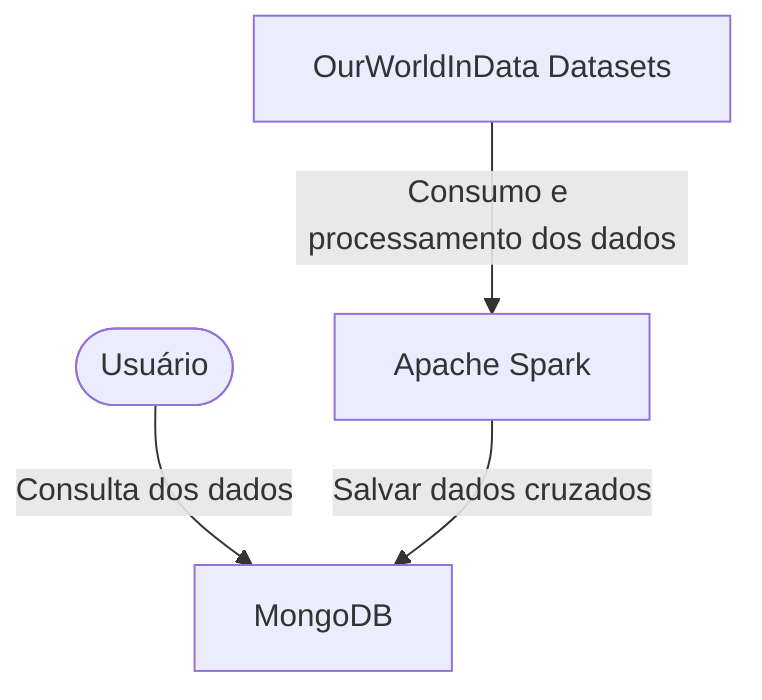

# A acessibilidade da alimentação no mundo
## Resumo do tema
O projeto tem como tema a acessibilidade da alimentação no mundo, utilizando dados públicos disponíveis na plataforma ourworldindata, especificamente sobre preços e disponibilidade de alimentos. Para isso, o Apache Spark será utilizado para o processamento e cruzamento de dados em JSON, utilizando atributos em comum para cruzar os dados como: país, ano, continente e etc. O banco de dados NoSQL MongoDB será utilizado para armazenar os resultados desses cruzamentos, para facilitar a análise desses dados por meio de consultas Map/Reduce e agregações (Figura 1). 
O objetivo é explorar aspectos relevantes de acessibilidade alimentar globalmente, identificando padrões e disparidades entre regiões, tentando levantar dados que consigam relacionar a acessibilidade a uma alimentação saudável com outros dados públicos, e inferir a partir destes, se conseguimos associar o acesso à comida a outras métricas dos países.

<b>Figura 1:</b> Fluxograma do funcionamento

